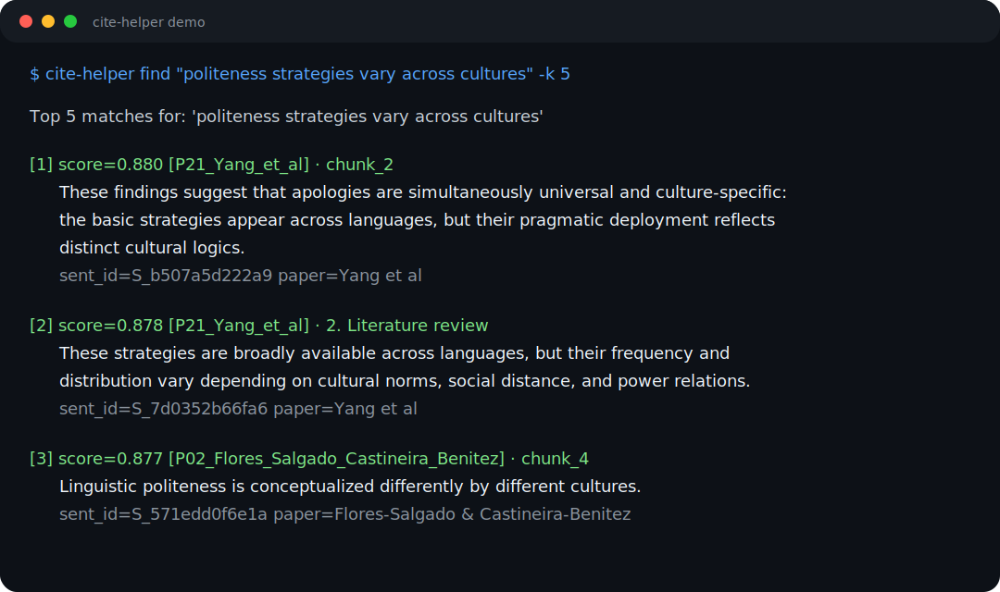

# cite-helper

[](https://github.com/Sirui830/cite-helper/actions/workflows/ci.yml)
[](https://github.com/Sirui830/cite-helper)
[](LICENSE)
[](https://github.com/Sirui830/cite-helper/releases)

> Sentence-level citation retrieval over a folder of academic PDFs.
> Find candidate verbatim quotes from your indexed PDF library without
> manually scrolling through papers.

You write a sentence in your draft. cite-helper returns the most
semantically similar sentences from your PDF library, with paper and
section info, so you can cite the right source — verbatim.

Built for academic writing workflows where you've already collected
the papers you want to cite, and you just need to surface the right one.



## Quick start

```bash
# Install directly from GitHub
pip install git+https://github.com/Sirui830/cite-helper.git

cd ~/my-references               # any folder with PDFs

# First query auto-builds the index (~1-2 min per 10 PDFs)
cite-helper find "politeness strategies vary across cultures"

# Subsequent queries reuse the saved index
cite-helper find "rapport management framework"

# Focus search when you already know the likely paper or section
cite-helper find "WeChat users prefer direct requests" \
  --paper Liu --section Conclusion --show-context 2
```

For an isolated CLI install, use `pipx`:

```bash
pipx install git+https://github.com/Sirui830/cite-helper.git
```

For local development:

```bash
git clone https://github.com/Sirui830/cite-helper.git
cd cite-helper
pip install -e ".[dev]"
```

Output looks like this:

```
Top 5 matches for: 'politeness strategies vary across cultures'

[1] score=0.881  [P21_Yang_et_al] · 5. Discussion
    These findings suggest that apologies are simultaneously universal and culture-specific...
    context: ...acknowledgment or repair. >>>These findings suggest that...<<< ...
    sent_id=S_b507a5d222a9  paper=Yang et al

[2] ...
```

## Why this exists

When you're writing a literature review and want to support a claim,
typically:
- You vaguely remember which paper said it
- You spend 10 minutes scrolling the PDF
- You eventually find the right sentence and quote it

cite-helper speeds up step 3 by indexing your PDFs at the sentence
level with `multilingual-e5-small` embeddings, then reusing that saved
index for later searches.

## Commands

```bash
# Build index from PDF folder (or let `find` auto-build it)
cite-helper build ./my-papers

# Build from a LitReview+ source_index.jsonl (skip PDF parsing)
cite-helper build ./target --from-source-index outputs/source_index.jsonl

# Semantic search (auto-builds index if missing and folder has ≤30 PDFs)
cite-helper find "your claim" [-k 5] [--json] [--folder PATH]

# Focus retrieval and control context display
cite-helper find "your claim" --paper Liu --section Discussion
cite-helper find "your claim" --show-context 2
cite-helper find "your claim" --no-context

# Verify a verbatim quote exists in the corpus
cite-helper verify "exact text from a paper"

# Show index metadata
cite-helper stats
```

## How it works

- **Sentence splitting**: `pysbd` — handles `e.g.`, `et al.`, decimals,
  citation-year patterns that break naive `.`/`!`/`?` splitting
- **Embedding**: `intfloat/multilingual-e5-small` (470 MB, 100+ languages,
  E5 `query:` / `passage:` prefix convention)
- **Filtering**: drops References / Bibliography / Acknowledgments /
  Funding sections; deduplicates identical sentences within a paper;
  heuristically skips reference-list entries and standalone title-like
  sentences that survive
- **Retrieval**: cosine similarity on L2-normalized embeddings
- **Focused search**: optional `--paper` and `--section` filters narrow the
  candidate pool before ranking, while `--include-noise` lets you inspect
  raw title/reference-like hits if needed

## Index format

Built indexes live under `<folder>/.cite_helper_index/`:

```
.cite_helper_index/
├── meta.json                    # model_name, embedding_dim, n_papers, ...
├── sentences.jsonl              # 1 line per sentence, 13 traceable fields
└── sentence_embeddings.npy      # [N, 384] float32 normalized
```

Each indexed sentence carries 13 fields including `source_text_sha1`,
`source_chunk_id`, `char_start`/`end`, and `context_before`/`after` so
every hit traces back to the originating chunk and can be verified
against the PDF.

## Integrations

### opencode

Save as `~/.config/opencode/command/citehelper.md`:

````markdown
---
description: Find sentences in the local PDF corpus most similar to a claim. Always quote your query.
agent: build
---

The user invoked /citehelper. Show the cite-helper output verbatim.
Add one short summary line naming which papers appear most often.

User input: $ARGUMENTS

cite-helper output:
!`cite-helper find $ARGUMENTS -k 5 2>&1`
````

Then in opencode:

```
/citehelper "politeness strategies vary across cultures"
```

First query in a new folder auto-builds the index (~1-2 min per 10 PDFs).
Subsequent queries reuse the saved index and should be much faster.

### Claude Code

Save as `~/.claude/commands/citehelper.md` (same markdown as opencode).
Use `/citehelper "your claim"` in Claude Code chat.

### Cursor

Add to Cursor Rules:

```
When the user asks to find citations or verbatim sentences for a claim,
run `cite-helper find "<their claim>"` in the project's reference folder.
```

### Plain terminal

```bash
cite-helper find "politeness varies across cultures"
```

## Auto-build behavior

`cite-helper find` checks for `.cite_helper_index/`:

- **Exists** → query immediately
- **Missing, ≤30 PDFs** → silently builds, then queries
- **Missing, >30 PDFs** → warns and exits (prevents accidental long
  builds in a downloads folder). Re-run with `--yes`, raise the
  threshold with `--auto-build-max N`, or build explicitly with
  `cite-helper build .`.

Pass `--no-auto-build` to disable auto-build entirely.

## Limitations (v0.1)

- **PDF noise**: uses `pymupdf4llm` with light cleanup. Multi-column
  layouts, dehyphenation, and page-number stripping are not done.
  Sentences may contain artifacts inherited from the underlying PDF
  parser. Cosine similarity is robust to these; presentation is not.
- **Section detection** works best on standard IMRaD papers (Introduction
  / Methods / Results / Discussion).
- **No incremental rebuild**: re-running `build` re-parses every PDF.
  PDF hashes are stored in `meta.json` but not yet used to skip unchanged
  files. Planned for v0.2.
- **Single-folder indexes**: each PDF folder gets its own
  `.cite_helper_index/`. There is no global cross-folder index.

## Testing

```bash
# Build the test index against a LitReview+ source_index.jsonl
cite-helper build /tmp/cite-helper-test \
  --from-source-index ~/some-litreview/outputs/source_index.jsonl

# Run regression tests against /tmp/cite-helper-test
pytest -xvs tests/

# Or point to a different index location
CITE_HELPER_TEST_FOLDER=/path/to/index pytest -xvs tests/
```

27 regression tests covering 21 queries + dedup + verify + focused filters.

## License

MIT. See [LICENSE](LICENSE).
